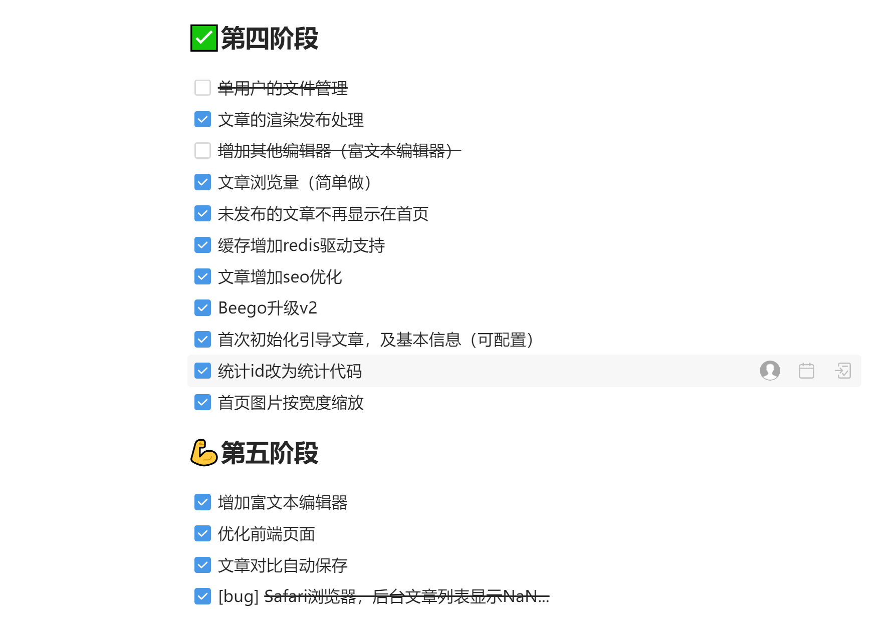

# enianBlog 团队博客

> 注意：目前项目正在开发中，还有一些功能未开发完成，大家不要用在正式环境中。有想参与开发的小伙伴可以联系我(群和联系方式在下方)！

大家可以去看[B站视频开发vlog](https://space.bilibili.com/27407696)。


## 介绍
enianBlog(E念博客)是一个支持多人使用的团队博客系统。是基于前端layui和后端go语言的beego框架开发。支持专栏、标签、SEO、markdown语法等特色功能！

## 适合用户
个人、开发团队、各行业人员。

## 软件架构

| 名称       | 版本   | 说明                                     |
| ---------- | ------ | ---------------------------------------- |
| Go         | 1.13+  | 后端主要语言                             |
| beego      | 1.12.0 | 基于后端框架                             |
| Layui      | 2.4.5  | 前端UI组件                               |
| 自研app.js | -      | 基于layui开发。实现单页，主要应用于后台  |
| editor     |        | 前端markdown组件，用于编辑文章和渲染     |
|            |        | 前端富文本编辑器插件，用于编辑文章和渲染 |
| mysql      | 5.7    | 数据库（二选一）                         |
| sqlite3    | -      | 数据库（二选一）                         |

## 功能及进度


### 开发计划

[点此查看完整开发计划](https://thoughts.teambition.com/share/624be0f1483c2900418ca6c9#title=团队博客开发计划)



## 运行

### 1.配置数据库驱动及其信息
程序本身支持sqlite和mysql数据库。配置文件是`./conf/app.conf`。复制`app.example.conf`命名为`app.conf`

### 2.运行

```
bee run
```
> 首次运行创建创建数据表信息，请注意控制台提示！

### 3.访问
浏览器访问：`http://127.0.0.1:8080`

## 预览版使用教程

**（由于未开发完，目前仅编译Windows版本）**

后续功能开发差不多并且时间充裕后有时间写文档再开源

#### 第一步：安装Mysql数据库软件

安装mysql数据库，以及数据库管理工具。

#### 第二步：创建数据库及用户

创建数据库及用户

#### 第三步：下载项目及配置修改

> 下载文件解压预览版（项目首页后边）


1. 下载项目 **enian_blog_dev.zip** 解压后找到项目文件夹

1. 进入 **enian_blog_dev\conf** 文件夹。

1. 打开 **app.conf** 修改上面设置的数据库连接信息

#### 第四步：运行项目

浏览器输入 **http://127.0.0.1:8080** 即可运行

如果8080端口占用，请在 **app.conf** 配置文件中修改 **httpport** 项即可

## 关于作者

微信/QQ:95302870（避免骚扰请注明来意）

Q群：685960647
