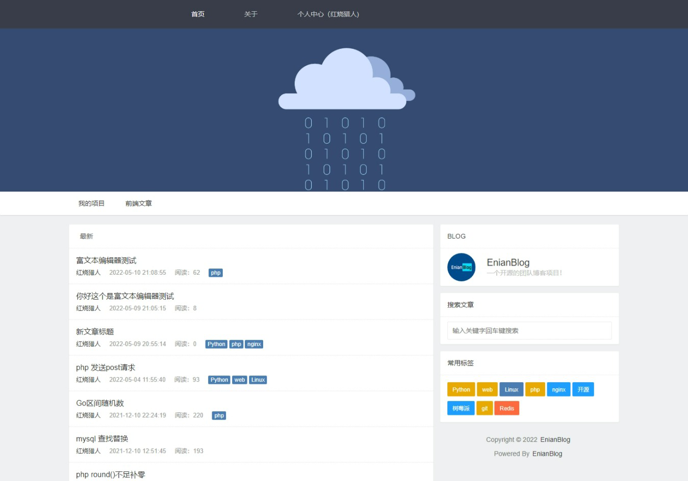
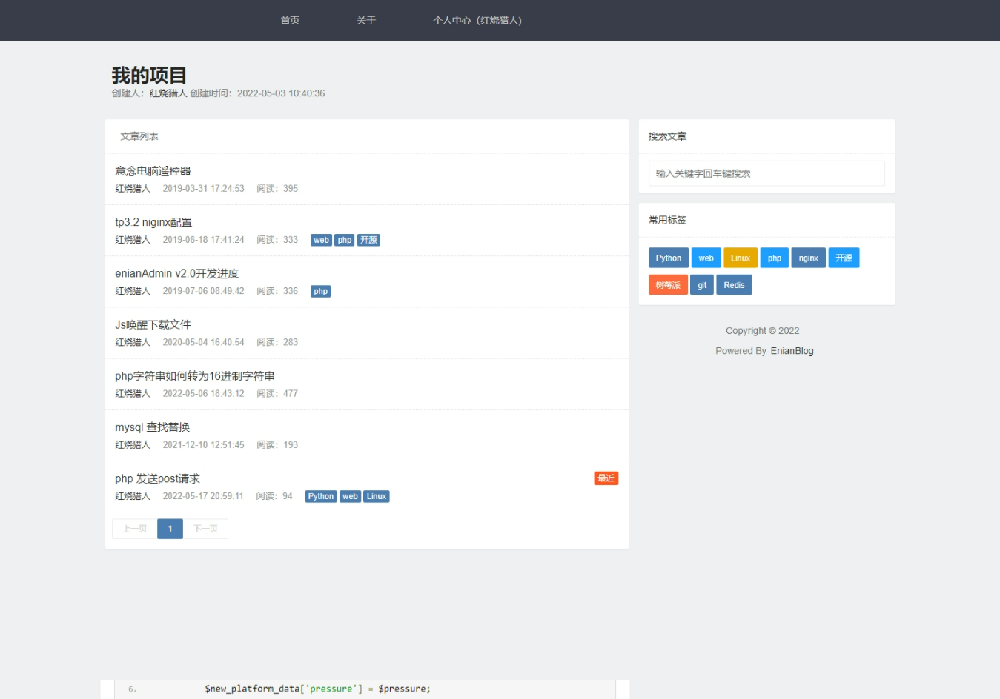
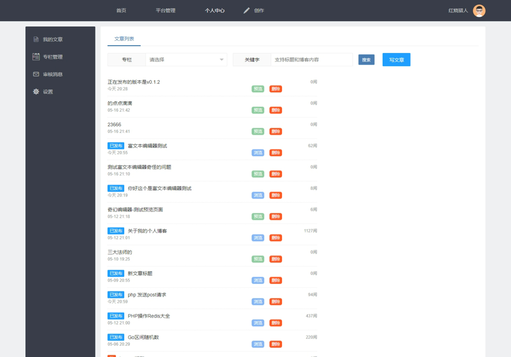
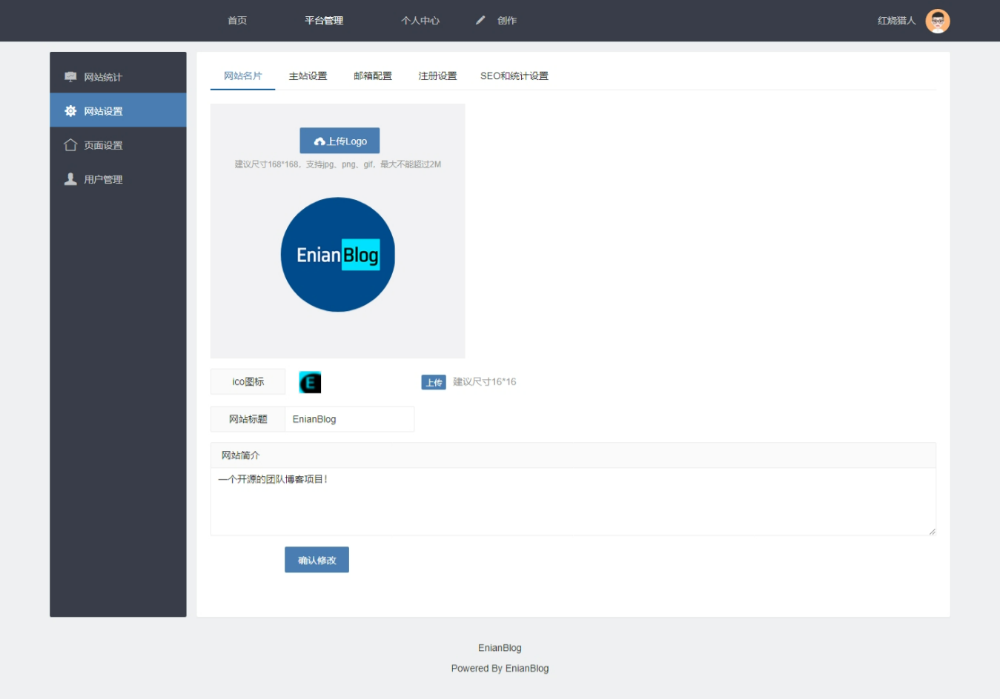
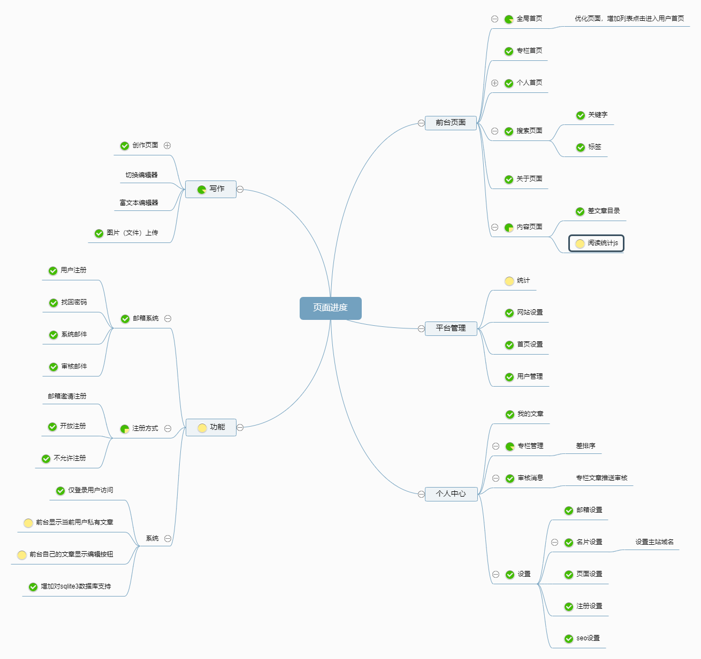

<p align="center">

<br>
EnianBlog(E念博客)
<br>
<a title="官方文档地址" target="_blank" href="http://hslr.gitee.io/doc_enian_blog">网站/文档</a> |
<a title="更新日志" target="_blank" href="http://hslr.gitee.io/doc_enian_blog/update_log">更新日志</a> |
<a title="意见反馈" target="_blank" href="https://support.qq.com/product/412977">意见反馈</a> |
<a title="Github" target="_blank" href="https://github.com/hslr-s/enian_blog">Github</a> |
<a title="Gitee" target="_blank" href="https://gitee.com/hslr/enian_blog">Gitee</a> 

</p>


## 🌈 介绍
EnianBlog(E念博客)是一个支持多人使用的团队博客系统。是基于前端layui和后端go语言的beego框架开发。支持专栏、标签、SEO、markdown语法、同时支持人人都会使用的富文本编辑器等诸多特色功能！

> 更新日志：http://hslr.gitee.io/doc_enian_blog/update_log <br>文档：http://hslr.gitee.io/doc_enian_blog


##### 小伙伴请看：
 - 项目正在测试阶段，暂不能保证无缝升级，新功能不断的增加到开发计划中。
 - 有想参与开发的小伙伴可以联系我(群和联系方式在下方)！
 - 目前正在学习Go语言，代码如果哪里不完美欢迎指点。
 - 大家可以去看[B站视频开发vlog](https://space.bilibili.com/27407696)。给个三连，让更多人看到。多谢🧡🧡🧡 
 - 如果不想自己编译可以下载[发布版](https://gitee.com/hslr/enian_blog/releases)，目前已编译windows64和linux64版本

## 🎇 演示站点信息

由于服务器资源有限，不再提供demo演示，请直接下载编译后的可执行文件使用。

<!- 
- 前台地址：[点击直达](http://demoblog.enianteam.com/ "点击直达")
- 后台地址：[点击直达](http://demoblog.enianteam.com/profile/auth.html#/login "点击直达")
- 演示账号：admin  演示密码：111111
->

## 🎉 适合用户
个人、开发团队、各行业人员。


## 🎨 软件架构

| 名称       | 版本   | 说明                                     |
| ---------- | ------ | ---------------------------------------- |
| Go         | 1.13+  | 后端主要语言                             |
| beego      | v2 | 基于后端框架                             |
| Gorm|1.9|orm框架，目前支持库sqlite和mysql|
| Layui      | 2.4.5  | 前端UI组件                               |
| editor.md     |        | 前端markdown组件，用于编辑文章和渲染     |
|   wangEditor       |        | 前端富文本编辑器插件，低门槛，用户上手容易，用于编辑文章和渲染 |

## 🚀 升级说明及更新日志
[升级说明](http://hslr.gitee.io/doc_enian_blog/guide/update "升级说明")

[更新日志](http://hslr.gitee.io/doc_enian_blog/update_log "更新日志")


## ✨ 页面截图
(前4张为前台，后4张为后台)

|||
|---|---|
|| |
|||
|| |
|||

## ⛳ 功能、进度、计划
> 此脑图更新不及时仅供参考



#### 开发计划

[点此查看完整开发计划](https://thoughts.teambition.com/share/624be0f1483c2900418ca6c9#title=团队博客开发计划)

## 👑 编译运行

### 1.配置数据库驱动及其信息
程序本身支持sqlite和mysql数据库。配置文件是`./conf/app.conf`。复制`app.example.conf`命名为`app.conf`

### 2.（可选）压缩前端文件夹（可参考["批量压缩前端代码，保持原始结构 - Minify"](http://blog.enianteam.com/u/sun/content/131)）

### 3.运行

```
bee run
```
> 首次运行创建数据表信息，以及admin的密码，请注意控制台提示！

### 4.访问
浏览器访问：`http://127.0.0.1:8080`

## 📙 发布版使用教程


地址：[直达发布版页面](https://gitee.com/hslr/enian_blog/releases)

**（已编译Windows64和Linux64为版本，其他系统版本请拉取代码自行编译）**


#### 1.安装Mysql数据库软件（可跳过）

> 项目默认使用sqlite数据库，如果不使用mysql可直接看下一步

安装mysql数据库，以及数据库管理工具，创建数据库及用户

#### 2.下载项目及配置修改

> 下载文件解压[发布版](https://gitee.com/hslr/enian_blog/releases)

1. 下载项目 **enian_blog_dev.zip** 解压后找到项目文件夹

1. 进入 **enian_blog_dev\conf** 文件夹。

1. 打开 **app.conf** 修改上面设置的数据库连接信息

#### 3.运行项目

进入目录中直接命令行运行
```
# windows(支持双击运行。不建议直接使用自带的cmd软件执行）
.\enian_blog.exe

# linux 
./enian_blog

```

浏览器输入 **http://127.0.0.1:8080** 即可运行（如果8080端口占用，请在 **app.conf** 配置文件中修改 **httpport** 项即可）


## 😁 关于作者

微信/QQ:95302870（避免骚扰请备注）

Q群：685960647
